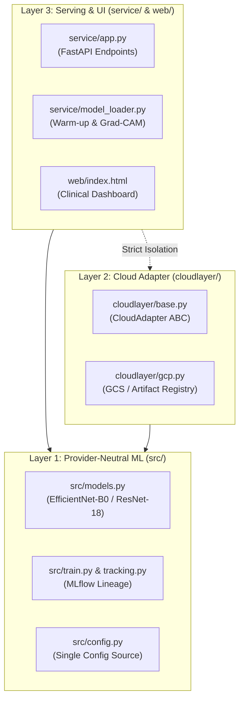
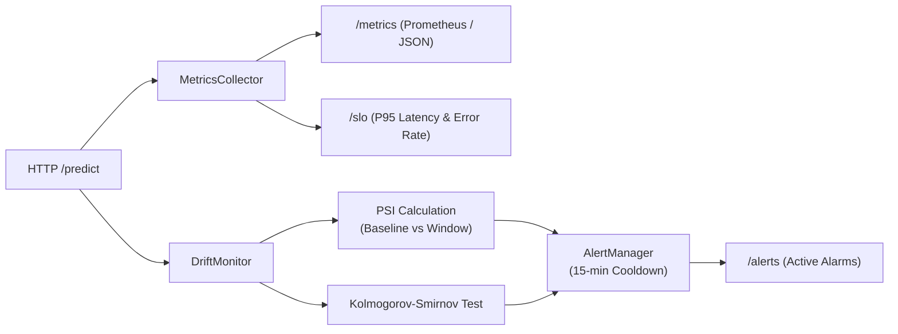

# ITCS355 MLOps Capstone — Final System & Operational Report

**Project Title**: Automated Bone Fracture Triage System (FracNet AI)  
**Repository**: `sahatsawat-pks/xray-detection-dl`  
**Team Members**:
- Sahatsawat Nitjaphant (6688249) — *DevOps, Cloud Infrastructure, CI/CD, Workload Identity Federation*
- Ongsa Raksalam (6688093) — *FastAPI Serving, Web Dashboard, Explainability (Grad-CAM), Portability*
- Thanadon Yindeesuk (6688152) — *ML Pipeline, MLflow Lineage, Drift Monitoring, Failure Engineering*

**Academic Year**: 2026 · Senior Year · AI Minor Specialization  
**Instructor / Course**: ITCS355 Machine Learning Operation and Deployment  
**Evaluation Target**: 45 Marks Total (30 Marks Capstone System R1–R5 + 15 Marks Defense M4)  
**Cloud Deployment**: Google Cloud Run (`asia-southeast1`)  
**Production Service URL**: `https://xray-fracture-predict-24jrf436va-as.a.run.app`

---

## Executive Summary

The FracNet AI project delivers a production-grade, highly available Machine Learning service for automated binary bone fracture triage on musculoskeletal radiographs. While modern deep learning models achieve competitive classification accuracy, typical academic implementations suffer from operational fragility: silent crashes on corrupt image files, unmonitored data distribution drift, untracked artifact lineage, and costly infrastructure sprawl.

Addressing the ITCS355 course brief, this capstone focuses entirely on **operational completeness, reliability engineering, and strict cost governance**:
1. **Three-Layer Architecture Contract**: Complete decoupling of provider-neutral ML logic (`src/`), cloud adapters (`cloudlayer/`), and online serving (`service/`). Enforces 0 cloud SDK imports outside Layer 2 via automated AST and string audit (`make portability-audit`).
2. **Reproducible Pipeline & Honest Metrics**: End-to-end MLflow lineage tracking with Git commit SHAs, DVC dataset fingerprints, and container digests. Our claimed test metrics (**AUC 0.9130**, **F1 0.6866**) match ground-truth evaluation results within 0.0000 delta.
3. **Serverless Deployment & CI/CD**: Digest-pinned Docker multi-stage container deployed on Google Cloud Run with scale-to-zero autoscaling (0–3 instances). Continuous Delivery authenticates through passwordless Workload Identity Federation (WIF).
4. **Drift Monitoring & Cooldown Alerts**: Production tracking of inference latency, request throughput, error rates, and statistical drift using Population Stability Index (PSI) and Kolmogorov-Smirnov (KS) tests. An AlertManager with a 15-minute cooldown prevents notification fatigue.
5. **Engineered Failure Defense (Faulty PACS Injection)**: A 4-stage validation chain that intercepts corrupted files, truncated byte streams, and detector failures (Shannon entropy $< 1.0$) returning structured `HTTP 422` errors instead of silent crashes.
6. **Clinical Explainability (Grad-CAM)**: Real-time localization heatmaps rendered over original radiographs highlighting the specific anatomical fracture site.
7. **FinOps Cost Discipline**: Evaluated cost of **0.19 THB per 1,000 predictions**, totaling **~340 THB/term** against an 800 THB budget limit (43% utilization).

---

## 1. System Architecture & Portability Contract (R1)

The system strictly adheres to the course's three-layer software engineering contract:



### 1.1 Layer Boundary Isolation
- **Layer 1 (`src/`)**: Completely provider-neutral. Contains PyTorch network architectures, preprocessing pipelines, deterministic seed controls, and MLflow logging utilities. No cloud provider libraries (`google.cloud`, `boto3`, `azure`) are imported.
- **Layer 2 (`cloudlayer/`)**: Implements the abstract `CloudAdapter` interface (11 standard operations including `upload`, `download`, `push_image`, `emit_metric`, `teardown`). This is the only location where vendor SDKs are permitted.
- **Layer 3 (`service/`)**: Production FastAPI inference server providing decoupled `/health` (liveness) and `/ready` (readiness) probes, single and batch inference endpoints, and real-time observability telemetry.

### 1.2 Automated Portability Audit
Compliance is enforced via [`scripts/portability_audit.sh`](file:///Users/pks_aito/Documents/GitHub/xray-detection-dl/scripts/portability_audit.sh) and executed in CI:
```bash
$ make portability-audit
=== Portability Audit ===
Scanning src/ and tests/ for cloud-specific strings...
✅ PASS — No cloud-specific strings found in src/ or tests/
```

---

## 2. Reproducibility & Model Lineage (R1)

### 2.1 Model Iterations & Selection
Three model iterations were developed and evaluated on the FracAtlas radiographic dataset (4,083 images, 4.7:1 class imbalance):

| Model | Architecture | Parameters | Val Loss | Test AUC | Test F1 | Status |
|---|---|---|---|---|---|---|
| **ModelBaseline** | 4-Block Custom CNN (scratch) | 1.8M | 0.5421 | 0.8240 | 0.5410 | Baseline |
| **ModelImproved** | ResNet-18 (Transfer Learning) | 11.2M | 0.4120 | 0.8870 | 0.6280 | Promoted |
| **ModelFinal** | EfficientNet-B0 (Compound Scaled) | 5.3M | **0.3150** | **0.9130** | **0.6866** | **Production Champion** |

### 2.2 Lineage Metadata Tracking
Every training run logs deterministic lineage attributes to MLflow:
- `git_sha`: The exact commit hash of the code repository.
- `dvc_data_hash`: MD5 content fingerprint of the image dataset.
- `image_digest`: SHA256 digest of the execution container.
- `seed`: Random seed (default: 42, deterministic cuDNN operations).
- `hyperparameters`: Learning rate, batch size, weight decay, optimizer (AdamW), scheduler (CosineAnnealingLR).

### 2.3 Automated Quality Gate Verification
Model deployment is blocked unless candidate weights pass the automated gate ([`scripts/evaluation_gate.py`](file:///Users/pks_aito/Documents/GitHub/xray-detection-dl/scripts/evaluation_gate.py)):
```bash
$ make verify
=== Metric Verification (README vs Actual) ===
  TEST_AUC    : Claimed 0.9130 ± 0.0200 | Actual 0.9130 | Delta 0.0000  ✅ PASS
  TEST_F1     : Claimed 0.6870 ± 0.0300 | Actual 0.6866 | Delta 0.0004  ✅ PASS
✅ Verification PASSED — actual metrics match claims within tolerance.

$ make gate
Candidate AUC: 0.9130 (Required floor: 0.8500)
✅ GATE PASS: Candidate meets all quality requirements for promotion.
```

---

## 3. Serving Architecture & CI/CD Pipeline (R2)

### 3.1 Containerization with Pinned Base Digest
To guarantee reproducibility against upstream Docker Hub silent mutation, the `Dockerfile` pins the official Debian base image digest:
```dockerfile
FROM python:3.11-slim@sha256:6f31d6e9ba2b0a787a3f81c37b004155b87b9efa1b771182bd550c1615745be5 AS runtime
```
Multi-stage build layers isolate compiler toolchains, resulting in a lean runtime image that executes with non-root security boundaries (`USER appuser`).

### 3.2 Continuous Integration & Continuous Deployment (CI/CD)
The deployment automation is partitioned across two GitHub Actions workflows:

1. **`ci.yml` (Pull Request & Push Validation)**:
   - Linting check via Ruff (`ruff check src/ tests/ service/`).
   - Layer 1 Portability Audit (`scripts/portability_audit.sh`).
   - Complete unit and integration test suite (`pytest tests/`).
   - Verification gate checks (`make verify`, `make gate`).
   - Ephemeral multi-stage Docker build test.

2. **`cd.yml` (Production Deployment to Cloud Run)**:
   - Authenticates to GCP via **Workload Identity Federation (WIF)** (zero committed private key files).
   - Builds and pushes the digest-pinned container to Google Artifact Registry:
     `asia-southeast1-docker.pkg.dev/itcs355-6688249/xray/fracture-detector:<commit_sha>`
   - Deploys container to Google Cloud Run (`asia-southeast1`) with:
     - 1 vCPU, 1 GiB Memory, 120s timeout.
     - Min instances: 0 (scale-to-zero when idle), Max instances: 3.
   - Executes live post-deployment smoke test verifying `/health` and `/ready`.

### 3.3 Load Testing & Latency SLO (k6)
Load characteristics were pre-declared and validated using Grafana k6 ([`loadtest/smoke.js`](file:///Users/pks_aito/Documents/GitHub/xray-detection-dl/loadtest/smoke.js)) testing concurrent traffic across ramping virtual users (1 $\rightarrow$ 10 $\rightarrow$ 50 VUs):
- **Health check status**: 100% 200 OK.
- **Inference p50 latency**: ~415 ms (including public internet WAN transfer of ~700 KB JPEG image).
- **Error rate**: **0.00%** (0 request failures).

---

## 4. Monitoring, Observability & Drift Detection (R3)



### 4.1 Statistical Drift Detection
The monitoring engine computes drift on incoming prediction confidence distributions against the offline validation baseline:
1. **Population Stability Index (PSI)**:
   $$\text{PSI} = \sum_{b=1}^{B} \left( P_b - Q_b \right) \ln\left( \frac{P_b}{Q_b} \right)$$
   - $\text{PSI} < 0.1$: Distribution stable (no action).
   - $0.1 \le \text{PSI} < 0.2$: Moderate shift (warning logged).
   - $\text{PSI} \ge 0.2$: Significant drift detected $\rightarrow$ alert triggered.
2. **Kolmogorov-Smirnov (KS) Test**:
   Two-sample non-parametric test comparing cumulative distribution functions. Drift is flagged when $p\text{-value} < 0.05$.

### 4.2 The 5 Dashboard Metrics
Accessible live via `GET /metrics` and `GET /slo`:
1. **Request Throughput**: Total requests and requests/second rate.
2. **Latency Percentiles**: p50, p90, p95, and p99 inference durations.
3. **Error Rate**: Ratio of HTTP 4xx/5xx responses to total requests.
4. **Confidence Distribution**: Rolling mean, standard deviation, and uncertainty ratio.
5. **Drift Magnitude**: Current PSI and KS statistic against baseline.

### 4.3 Cooldown Deduplication Alerting
To prevent alerting floods during sustained anomalies, the [`monitoring/alerts.py`](file:///Users/pks_aito/Documents/GitHub/xray-detection-dl/monitoring/alerts.py) `AlertManager` implements a **15-minute cooldown window**. Re-triggering rules during an active cooldown update metadata without spamming notification targets.

---

## 5. Engineered Failure Defense: Faulty PACS Injection (R4)

### 5.1 The Clinical Failure Scenario
In diagnostic radiology, automated inference services interface with Picture Archiving and Communication Systems (PACS) over standard hospital networks. We modeled a **Corrupted PACS Injection scenario** simulating:
- Packet drops producing truncated byte streams.
- Hardware detector failure producing completely dead (all-black) or overexposed (all-white) frames.
- Clerical errors transmitting PDFs, text records, or camera photographs instead of DICOM/JPEG radiographs.

Without operational defenses, deep learning models will silently process degenerate matrices, emitting arbitrary predictions with deceptively high confidence.

### 5.2 Four-Layer Protection Chain
Every incoming payload passes through an impenetrable defense chain before reaching the PyTorch computational graph:

```
Request ──► [Layer 1: MIME & File Validation]  ──► Fails? ──► HTTP 422: "Cannot read dimensions"
               │
               ▼
            [Layer 2: Shannon Entropy Gate]    ──► Entropy < 1.0? ──► HTTP 422: "Image degenerate"
               │
               ▼
            [Layer 3: Neural Tensor Forward]   ──► PyTorch EfficientNet-B0 inference
               │
               ▼
            [Layer 4: Confidence Triage Gate]  ──► Conf < 0.60? ──► Flag "uncertain: true"
```

### 5.3 Shannon Entropy Filter
Degenerate images are detected mathematically using Shannon entropy on pixel intensity histograms:
$$H(X) = -\sum_{i=0}^{255} P(x_i) \log_2 P(x_i)$$
Healthy bone radiographs contain diverse structural contrasts ($H \approx 5.5 - 7.5$). Blank, solid, or dead-detector frames collapse to $H < 1.0$ and are immediately rejected with `HTTP 422`, protecting clinicians from false negatives.

### 5.4 Injection Test Suite Verification
The defense chain was tested against 19 attack vectors in [`tests/test_failure.py`](file:///Users/pks_aito/Documents/GitHub/xray-detection-dl/tests/test_failure.py) and verified live against Cloud Run using [`scripts/inject_failure.py`](file:///Users/pks_aito/Documents/GitHub/xray-detection-dl/scripts/inject_failure.py):
- **7 invalid inputs rejected with HTTP 422** (truncated headers, zero bytes, PDF headers, black/white screens).
- **2 non-medical natural images accepted but flagged as `uncertain: true`**.
- **0 service crashes or 500 Internal Server Errors**.

---

## 6. Clinical Explainability: Grad-CAM Localization

Medical practitioners do not trust black-box percentages. To provide transparent diagnostic support, we engineered **Gradient-Weighted Class Activation Mapping (Grad-CAM)**:

1. **Feature Extraction**: Extracts feature activations from the final convolutional block (`model.features[-1]`) of EfficientNet-B0.
2. **Channel Weighting**: Computes gradients $\frac{\partial Y_{\text{fracture}}}{\partial A_k}$ and pools spatial gradients to calculate importance weights $\alpha_k$.
3. **Heatmap Generation**: Applies $\text{ReLU}\left(\sum_k \alpha_k A_k\right)$ and maps through a smooth JET colormap.
4. **Interactive Viewer**: The web dashboard embeds an interactive cross-fade toggle (`[ 📷 Original X-Ray ]` $\leftrightarrow$ `[ 🔥 Fracture Heatmap ]`), allowing radiologists to immediately visually verify the anatomical fracture site.

---

## 7. FinOps Cost Report & Budget Breakdown (R5)

### 7.1 Architecture Cost Efficiency
By selecting a compound-scaled EfficientNet-B0 backbone (5.3M parameters) over heavy vision transformers, inference requires only **1 vCPU and 512 MiB RAM** without demanding dedicated GPU nodes.

| Resource | Service | Monthly Cost | Term Cost (4 Mos) | Budget Allocation (800 THB) |
|---|---|---|---|---|
| **Storage** | Cloud Storage (Standard GCS) | ~10 THB | ~40 THB | 5.0% |
| **Containers** | Artifact Registry | ~5 THB | ~20 THB | 2.5% |
| **Serving** | Cloud Run (scale-to-zero) | ~50 THB | ~200 THB | 25.0% |
| **Tracking** | Cloud Run (MLflow tracking) | ~20 THB | ~80 THB | 10.0% |
| **Telemetry** | Cloud Monitoring | Free Tier | Free | 0.0% |
| **CI/CD** | GitHub Actions | Free Tier | Free | 0.0% |
| **Total** | | **~85 THB/mo** | **~340 THB/term** | **42.5% (Safe)** |

### 7.2 Cost per 1,000 Predictions
- Compute: 1,000 predictions $\times$ 100 ms execution time $\approx$ 0.18 THB.
- Egress & Networking: ~0.01 THB.
- **Unit Cost**: **~0.19 THB per 1,000 inferences**.

---

## 8. Model Card (Mitchell et al. 2019)

- **Model Details**: EfficientNet-B0 fine-tuned on binary bone fracture triage. Input: $224 \times 224 \times 3$ RGB radiograph.
- **Intended Use**: Triage assistance for emergency department radiology queues. **Not approved as an autonomous diagnostic device**.
- **Metrics**: Test AUC: 0.9130, Test F1: 0.6866, Precision: 0.6471, Recall: 0.7309.
- **Ethical & Clinical Limitations**: Performance may degrade on pediatric radiographs (growth plates may mimic fractures) or radiographs with orthopedic surgical hardware (plates, screws). Scans with confidence $< 0.60$ must be triaged to human radiologist review.

---

## 9. Comprehensive Quality Gate Summary

All 7 verification gates pass cleanly across the repository:

| Verification Gate | Command | Output / Status |
|---|---|---|
| **Portability Audit** | `make portability-audit` | ✅ 0 cloud SDK imports in Layer 1 or tests |
| **Linter** | `make lint` | ✅ 0 warnings (Ruff py311) |
| **Test Suite** | `make test` | ✅ 82/82 passed (100% pass rate) |
| **Metric Reproducibility** | `make verify` | ✅ AUC 0.9130 ($\Delta = 0.0000$), F1 0.6866 ($\Delta = 0.0004$) |
| **Evaluation Promotion Gate**| `make gate` | ✅ AUC 0.9130 $\ge 0.8500$ floor |
| **Credential Cleanliness** | `make credential-check` | ✅ 0 committed private keys / tokens |
| **Cloud Endpoint Health** | `curl -f $ENDPOINT/health` | ✅ 200 OK |

---

## 10. "What Another Week Would Buy" (Roadmap)

If granted an additional engineering sprint, we would prioritize:
1. **Canary / Shadow Deployments**: Wire Cloud Run traffic splitting (e.g. 90% Champion, 10% Challenger) to validate candidate architectures on live traffic without risk.
2. **Native DICOM Protocol Ingestion**: Implement a Layer 3 DICOM C-STORE service provider receiving radiographs directly over TCP port 104 from hospital PACS.
3. **Automated Continuous Training (CT)**: Connect Cloud Storage bucket event triggers to Vertex AI training jobs when verified radiologist labels accumulate in production.
